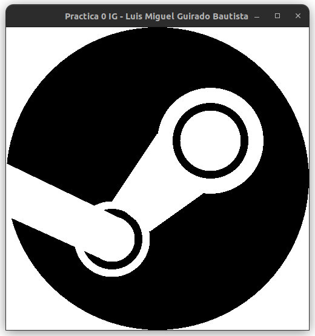
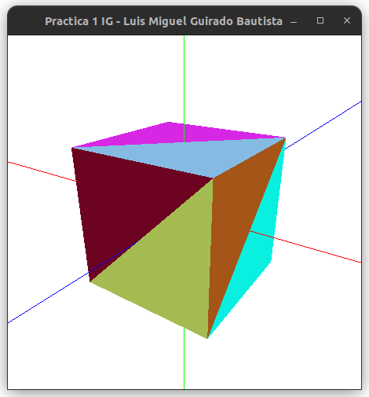

# Informática Gráfica

**Programación gráfica en C++ usando OpenGL**

## Práctica 0 - Introducción a OpenGL
**Objetivo**: Dibujar un isotipo

## Práctica 1 - Visualización de objetos 3D sencillos
**Objetivo**: Implementar un cubo y el coloreado aleatorio de las caras de una figura 3D cualquiera

