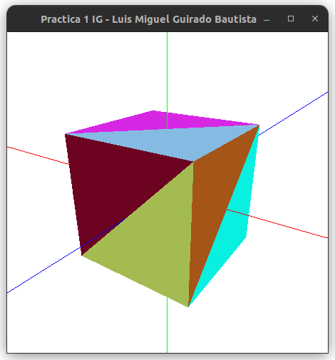
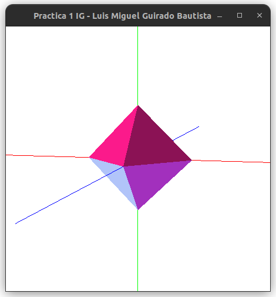
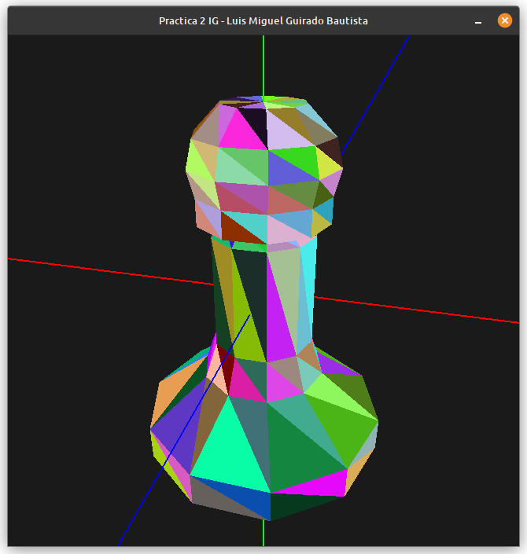
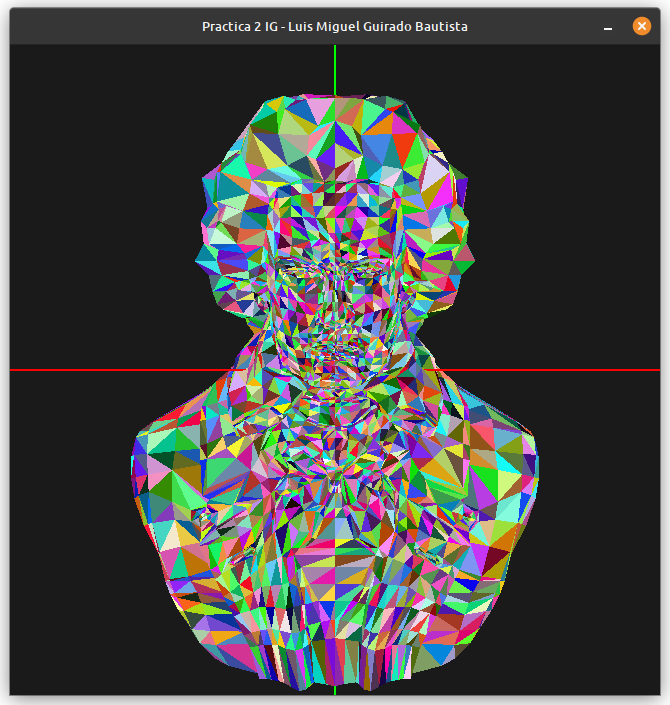
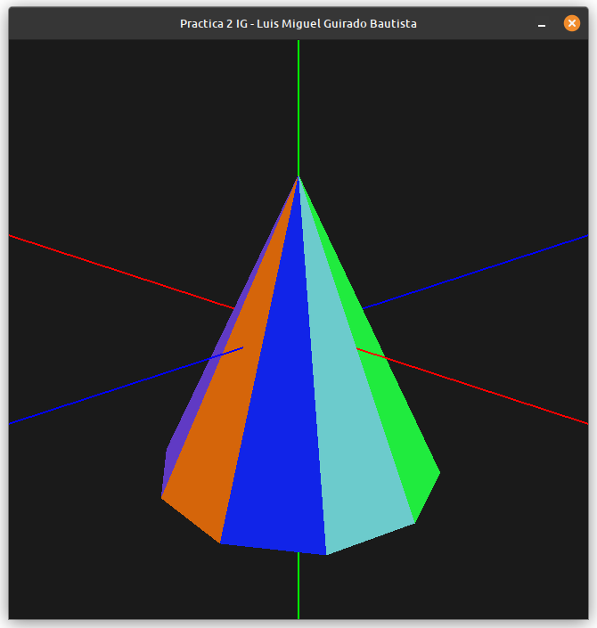
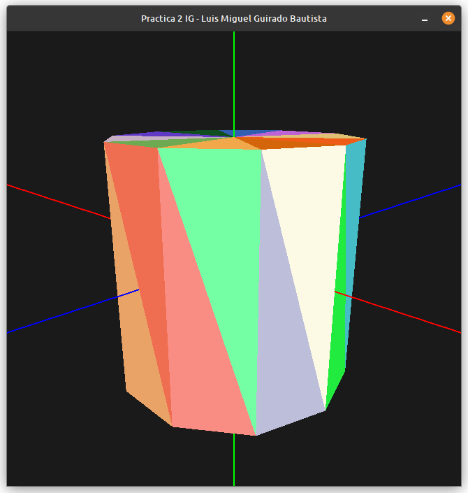
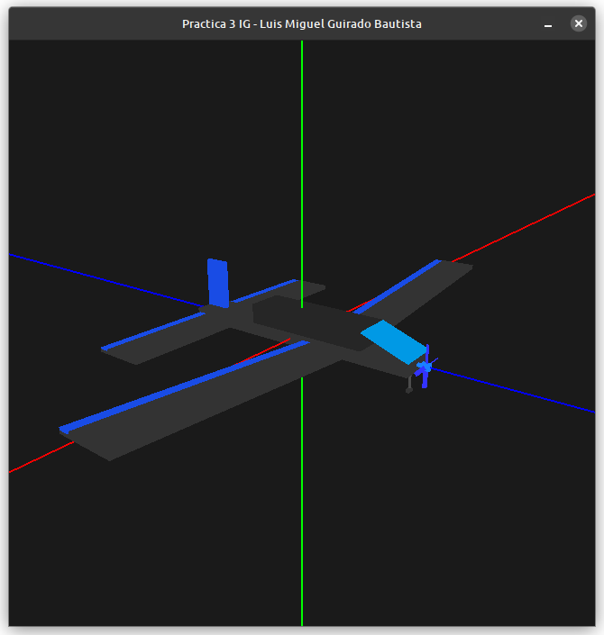
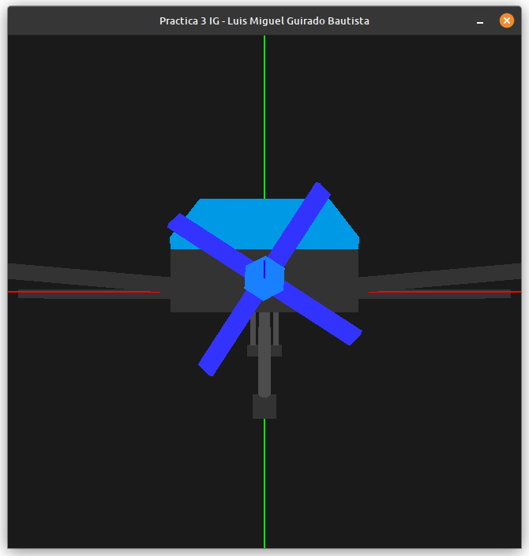
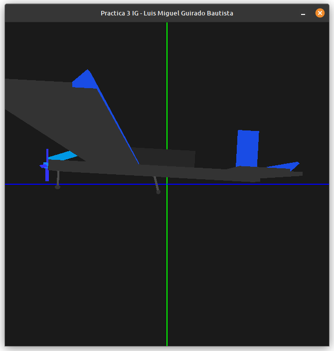
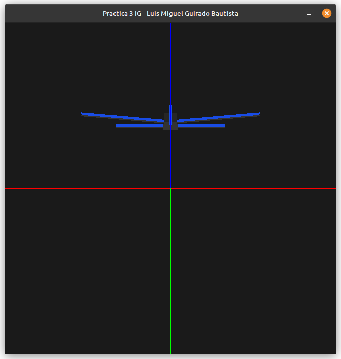

# Informática Gráfica

**Programación gráfica en C++ usando OpenGL**

---

## Práctica 0 - Introducción a OpenGL
**Objetivo**: Dibujar un isotipo

## Práctica 1 - Visualización de objetos 3D sencillos
**Objetivo**: Implementar un cubo, otra figura (octaedro) y el coloreado aleatorio de las caras de una figura 3D cualquiera

## Práctica 2 - Modelos PLY y poligonales

**Objetivos**:
- Implementar dibujado de polígonos almacenados en ficheros PLY
- Implementar dibujado de polígonos generados mediante rotación
  - El perfil se genera en tiempo de ejecución
  - El perfil se lee de un fichero PLY
- Implementar las clases cono, cilindro y esfera

## Práctica 3 - Modelos jerárquicos

**Objetivos**:
- Comprender como funciona la pila de transformaciones de OpenGL
- Realizar un modelo jerarquico con al menos 4 articulaciones (en este caso, una avioneta), modelando primero:
  - Alas con alerones
  - Helice de 4 aspas
  - Trenes de aterrizaje
  - Timon trasero
  - Fuselaje (cuerpo de la avioneta)
- Una animacion utilizando dicho modelo

*Me acabo de dar cuenta de que la capturadora me convierte los azules en morados y no tengo ni idea de por que* 🫤

